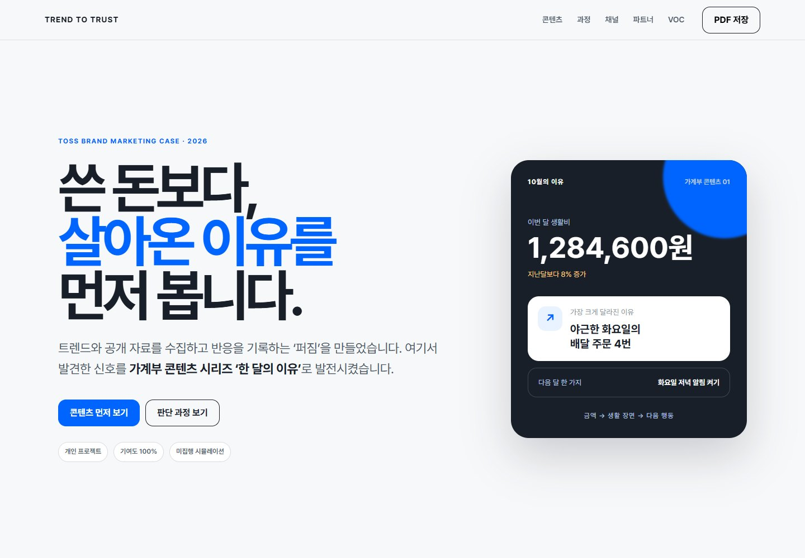
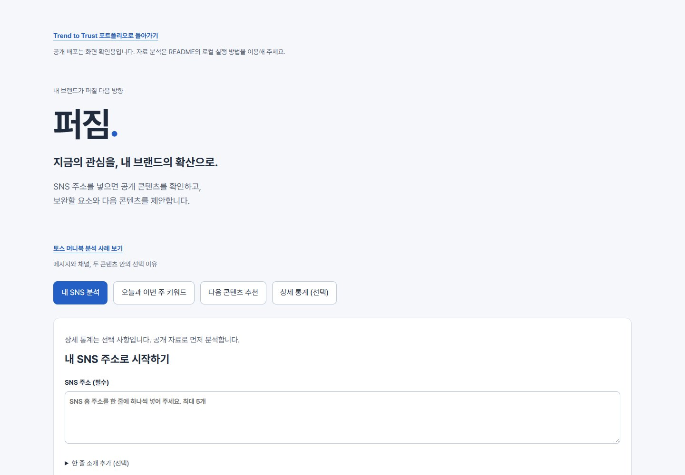

# Trend to Trust

> 트렌드와 공개 자료를 수집하고 반응을 기록하는 **퍼짐**을 만들고, 여기서 발견한 신호를 토스 가계부 콘텐츠 **‘한 달의 이유’**로 발전시켰습니다.

토스 Brand Marketing Specialist 직무를 목표로 만든 개인 포트폴리오입니다. 공개 자료를 찾는 도구 제작부터 트렌드 해석, 브랜드 메시지, 매체별 콘텐츠, 외부 제휴안, VOC(고객 의견) 기반 수정까지 하나의 업무 흐름으로 연결했습니다.

**[웹 포트폴리오 보기](https://jhheo51-arch.github.io/trend-to-trust/)** · **[메시지 검증 화면](https://jhheo51-arch.github.io/trend-to-trust/message-check.html)** · **[통합 기획서](docs/PRD.md)** · **[사례와 근거](docs/CASE-STUDY.md)**

## 처음 오셨다면

| 순서 | 어디서 무엇을 볼 수 있나요? |
|---|---|
| 1. 전체 이야기 | [웹 포트폴리오](https://jhheo51-arch.github.io/trend-to-trust/)에서 공개 신호 → 브랜드 메시지 → 콘텐츠 수정의 흐름을 봅니다. 설치 없이 열 수 있습니다. |
| 2. 판단 근거 | [사례 문서](docs/CASE-STUDY.md)에서 확인한 사실·캠페인 가설·가상 반응을 구분하고, [통합 기획서](docs/PRD.md)에서 선택 기준을 읽습니다. |
| 3. 업무 도구 | [퍼짐 화면](https://jhheo51-arch.github.io/trend-to-trust/tool.html)을 봅니다. **공개 주소는 화면 확인용이며, 공개 자료 수집 기능은 로컬 실행이 필요합니다.** |
| 4. 메시지 검증 | [메시지 검증 화면](https://jhheo51-arch.github.io/trend-to-trust/message-check.html)에서 P01~P05가 차례로 응답합니다. 응답은 사용 중인 브라우저에만 저장됩니다. |
| 5. 직접 실행 | 아래 [실행하기](#실행하기)에 따라 내 컴퓨터에서 퍼짐을 실행하고 자동 검사를 확인합니다. |

### 화면 미리보기

**대표 결과물 · Trend to Trust 캠페인**



**보조 업무 도구 · 퍼짐**



실제 화면을 캡처했습니다. 캠페인과 고객 의견은 시뮬레이션이며, 화면 예시는 실제 광고 성과나 고객 조사 결과를 뜻하지 않습니다.

**목차:** [프로젝트 흐름](#한눈에-보는-프로젝트) · [만든 것](#제가-만든-것) · [판단 사례](#핵심-판단-사례) · [직무 연결](#토스-직무와-연결한-역량) · [검증 범위](#사실과-시뮬레이션의-경계) · [실행](#실행하기) · [문서](#주요-파일과-문서)

## 한눈에 보는 프로젝트

| 단계 | 한 일 | 결과 |
|---|---|---|
| 신호 수집 | 퍼짐으로 공개 콘텐츠와 검색 관심 자료를 확인 | 읽은 정보와 읽지 못한 정보를 구분 |
| 의미 해석 | 생활비 부담, 정보 탐색, 깊이 있는 콘텐츠 흐름을 해석 | ‘절약’보다 ‘내 돈의 흐름 이해’라는 기회 정의 |
| 브랜드 메시지 | 토스의 쉬운 언어와 근거 중심 태도로 번역 | 가계부 콘텐츠 ‘한 달의 이유’ |
| 채널별 소재 | Meta, YouTube·Google, 토스 온드 채널별 소재 설계 | 금액→생활 장면→다음 행동 구조 |
| 제휴 제안 | 실제 공개 채널을 역할별로 비교 | 어피티·오늘의집·캐릿 제안 |
| 학습과 수정 | VOC를 공감·근거 요청·행동 요청으로 분류 | 1차 콘텐츠를 근거와 행동이 있는 2차안으로 수정 |

## 제가 만든 것

### 1. 브랜드 캠페인 사례

저장소의 첫 화면은 채용 담당자가 판단 과정을 빠르게 읽을 수 있는 포트폴리오입니다. 트렌드 자료에서 출발해 가계부 연재물 ‘한 달의 이유’를 만들고, 채널별 소재와 실제 파트너 후보를 설계한 뒤 VOC를 다음 콘텐츠에 반영합니다.

### 2. 신호 수집 도구 ‘퍼짐’

퍼짐은 공개 피드와 검색 관심 자료를 확인하고 다음 콘텐츠 두 안을 비교하는 로컬 도구입니다. 무엇을 실제로 읽었는지 표시하며, 확인하지 못한 소개·이미지·비공개 반응을 추정하지 않습니다.

현재 자동 분석 대상은 공개 RSS를 제공하는 블로그의 제목과 본문 일부입니다. Instagram 개별 게시물, 이미지, 조회·공유·저장 같은 비공개 통계는 자동으로 읽지 않습니다.

### 3. 판단을 남기는 검증 구조

자동 검사 27개로 주소 처리, 공개 자료 해석, 미확인 정보 표시, 추천 범위와 통계 계산을 확인했습니다. 퍼짐은 캠페인 성과를 예측하는 도구가 아니라 자료의 출처와 선택 이유를 남기는 업무 도구입니다.

## 핵심 판단 사례

대표 가계부 콘텐츠 **‘한 달의 이유’**에서는 다음과 같이 판단했습니다.

1. **확인한 신호:** 가계지출·소비성향 통계와 YouTube의 정보 이용·콘텐츠 트렌드 자료를 읽었습니다. 공식 자료 확인과 퍼짐의 자동 수집 범위는 구분합니다.
2. **캠페인 가설:** ‘무조건 절약’보다 ‘내 소비의 이유를 이해하도록 돕기’가 유용할 수 있다고 해석했습니다. 실제 사용자 욕구로 검증된 결론은 아닙니다.
3. **기획과 수정:** ‘금액 → 생활 장면 → 다음 행동’이라는 구조를 채널별로 구성하고, 가상 의견 12건을 공감·근거 요청·행동 요청으로 분류해 2차안에 계산 기준과 다음 행동을 추가했습니다.
4. **남은 검증:** 실제 사용자에게 두 안을 보여주고 메시지 이해와 선택 이유를 확인해야 합니다. 가상 의견에 맞춰 수정한 것을 실제 성과 개선으로 표현하지 않습니다.

[대표 캠페인의 근거 구분](docs/CASE-STUDY.md) · [토스 머니북 보조 분석 사례](https://jhheo51-arch.github.io/trend-to-trust/case.html)

## 토스 직무와 연결한 역량

| 채용 공고의 업무 | 포트폴리오에서 보여주는 내용 |
|---|---|
| 외부 채널·플랫폼 발굴과 제휴 | 어피티·오늘의집·캐릿 비교와 역할별 제안 |
| Meta·Google 매체별 소재 기획 | 채널별 첫 장면, 형식, 콘텐츠 흐름과 확인 지표 |
| 결과 분석과 다음 콘텐츠 반영 | VOC 분류와 1차→2차 콘텐츠 수정 |
| 온드 채널 콘텐츠와 브랜드 프로젝트 | 토스피드·앱 내 소비 리포트 연결안 |
| 트렌드를 브랜드 커뮤니케이션에 접목 | 공개 신호→해석→브랜드 역할의 구분 |
| 주도성과 빠른 학습 | 퍼짐 기획·구현, 규칙 기반 추천, 27개 자동 검사 |

## 사실과 시뮬레이션의 경계

- 공개 자료와 퍼짐의 동작·자동 검사 결과는 실제 확인 내용입니다.
- `한 달의 이유` 캠페인, 제휴 제안, VOC 12건과 광고 결과는 포트폴리오용 시뮬레이션입니다.
- 토스의 의뢰나 내부 협업, 실제 매체 집행, 실제 고객 조사 경험으로 주장하지 않습니다.
- 통계·플랫폼 자료의 사실과 지원자가 내린 해석을 화면에서 구분했습니다.

현재 구현의 동작 검증은 [GitHub 자동 검사 기록](https://github.com/jhheo51-arch/trend-to-trust/actions/workflows/check.yml)에서 확인할 수 있습니다. [제휴 후보 3곳 비교](docs/PARTNER-SHORTLIST-2026-10-08-v01.md)는 공개 자료를 바탕으로 작성했으며 실제 접촉·협업은 하지 않았습니다. 실제 사용자 5명 검증과 제출자 정보 보완은 [제출 전 점검](docs/SUBMISSION-AUDIT-2026-10-08-v01.md)에 남겨 두었습니다.

## 실행하기

화면만 보려면 상단의 웹 포트폴리오 링크를 이용하면 됩니다. 공개 자료 수집까지 사용하려면 **Node.js 22 이상**(프로그램 실행 도구)이 설치된 컴퓨터에서 다음 순서로 진행합니다.

### 1. 파일 내려받기

Git(소스 변경 기록을 관리하는 도구)이 있다면 터미널에 입력합니다.

```sh
git clone https://github.com/jhheo51-arch/trend-to-trust.git
cd trend-to-trust
```

Git 없이 시작하려면 [ZIP 파일](https://github.com/jhheo51-arch/trend-to-trust/archive/refs/heads/main.zip)을 내려받아 압축을 풀고, `package.json`이 있는 폴더에서 터미널을 엽니다.

### 2. 서버 실행

별도 패키지 설치와 인증값은 필요하지 않습니다. 내려받은 폴더에서 입력합니다.

```sh
npm start
```

브라우저에서 `http://127.0.0.1:4191/`을 열면 포트폴리오가, `http://127.0.0.1:4191/tool.html`을 열면 퍼짐이 표시됩니다.

GitHub Pages의 퍼짐 화면은 인터페이스 확인용입니다. 공개 자료를 읽는 서버 기능은 위 명령으로 로컬에서 실행할 때 작동합니다.

### 3. 자동 검사

같은 폴더에서 새 터미널을 열고 입력합니다. 주소 처리, 미확인 정보 표시, 추천 범위와 통계 계산을 확인하며 마케팅 효과를 검증하는 검사는 아닙니다.

```sh
npm test
```

서버를 종료하려면 `npm start`를 실행한 터미널에서 `Ctrl+C`를 누릅니다.

## 주요 파일과 문서

| 파일 | 내용 |
|---|---|
| [index.html](index.html) | Trend to Trust 포트폴리오 |
| [tool.html](tool.html) | 퍼짐 공개 신호 분석 도구 |
| [message-check.html](message-check.html) | 실제 사용자 5명 메시지 검증 화면 |
| [docs/PROJECT-ROADMAP-2026-10-08-v01.md](docs/PROJECT-ROADMAP-2026-10-08-v01.md) | 고도화 우선순위와 완료 기준 |
| [case.html](case.html) | 토스 머니북 공개 자료 분석 사례 |
| [docs/PRD.md](docs/PRD.md) | 통합 프로젝트의 목적·구조·검증 기준 |
| [docs/CASE-STUDY.md](docs/CASE-STUDY.md) | 캠페인과 도구 사례의 근거 구분 |
| [docs/PARTNER-SHORTLIST-2026-10-08-v01.md](docs/PARTNER-SHORTLIST-2026-10-08-v01.md) | 실제 파트너 후보 3곳의 공개 근거와 제안 |
| [docs/SUBMISSION-AUDIT-2026-10-08-v01.md](docs/SUBMISSION-AUDIT-2026-10-08-v01.md) | 제출 전 부족한 부분과 보완 순서 |
| [docs/퍼짐-프로젝트소개.pdf](docs/퍼짐-프로젝트소개.pdf) | 퍼짐 도구 소개 자료; 통합 캠페인 설명은 위 기획서 참고 |
| [docs/퍼짐-기능검증과통계기록.xlsx](docs/퍼짐-기능검증과통계기록.xlsx) | 퍼짐 기능 검증 기록 |

직접 입력한 통계와 선택 기록은 브라우저에, 키워드 수집 기록은 로컬 `runtime/`에 저장합니다. 개인 입력 기록과 `runtime/`은 GitHub에 포함하지 않습니다.
