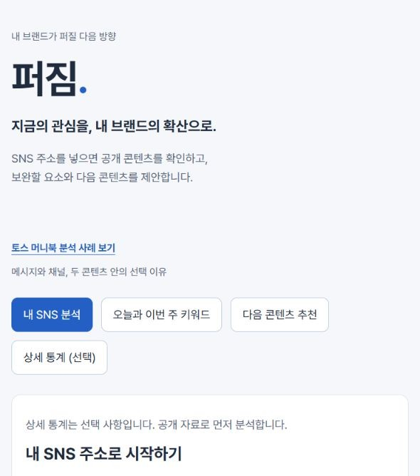

# 퍼짐

SNS 주소를 입력하면 공개 콘텐츠를 확인하고, 보완할 요소와 다음 콘텐츠를 제안합니다. 상세 통계는 선택적으로 추가합니다.



## 실행

Node.js 22 이상이 필요합니다. 저장소를 내려받은 뒤 이 폴더의 터미널에서 실행합니다.

```sh
npm start
```

브라우저에서 http://127.0.0.1:4191/ 을 여세요. 패키지 설치나 인증값 입력은 필요하지 않습니다.

## 사용

1. 내 SNS 분석에서 홈 주소를 입력합니다.
2. 공개 자료의 확인 여부와 보완할 요소를 읽습니다.
3. 다음 콘텐츠 추천에서 구성안을 검토합니다.
4. 오늘과 이번 주 키워드에서 소재와 뉴스 근거를 확인합니다.
5. 필요하면 상세 통계에서 게시물별 반응을 등록합니다.

읽지 못한 정보는 확인하지 못함으로 표시합니다. Instagram의 개별 게시물, 이미지와 비공개 반응 통계는 현재 자동으로 읽지 않습니다. RSS가 제공되는 블로그는 제목과 본문 일부를 분석합니다. 주소 등록과 콘텐츠 열람 가능 여부는 플랫폼에 따라 다릅니다.

## 제출 자료

- [기획서](docs/PRD.md)
- [프로젝트 소개 PDF](docs/퍼짐-프로젝트소개.pdf)
- [기능 검증과 통계 기록 Excel](docs/퍼짐-기능검증과통계기록.xlsx)
- [서비스 화면](docs/service-preview.jpg)

이 저장소에는 최신 구현과 최신 제출 자료만 보관합니다. 이전 로컬 버전과 개인 입력 기록은 포함하지 않습니다.

## 확인한 동작

```sh
npm test
```

자동 검사 27개로 주소 처리, 공개 자료 해석, 자료 미확인 표시, 추천 범위와 통계 계산을 확인했습니다. 실제 Instagram 주소에서 이름만 확인되는 경우에도 읽지 못한 소개와 게시물 반응을 추정하지 않는 결과를 확인했습니다.

현재 추천은 규칙 기반입니다. 공개 소개나 글의 표현에서 주제를 찾고, 읽은 제목 또는 선택 소개를 다음 콘텐츠의 기준으로 사용합니다. 검색량은 SNS 조회수와 다릅니다. 실제 바이럴 증가나 이용자 효과는 아직 측정하지 않았습니다.

## 구성

화면은 HTML, CSS와 JavaScript로 만들었습니다. Node.js 서버가 허용된 공개 사이트를 조회합니다. 외부 패키지를 사용하지 않습니다. 상세 통계와 선택 기록은 브라우저에 보관하며, 키워드 수집 기록은 로컬 runtime 폴더에 저장합니다.

폰트는 Pretendard를 사용합니다. 배포 조건은 assets/fonts/LICENSE.txt에 있습니다.


## 토스 머니북 분석 사례

메인 화면의 ‘토스 머니북 분석 사례 보기’를 누르면 확인한 자료, 채널의 역할, 후속 콘텐츠 두 안과 선택 이유를 볼 수 있습니다. 직접 확인한 공식 자료를 바탕으로 한 독립 분석이며 실제 캠페인 집행 경험으로 주장하지 않습니다.

- [사례 근거와 제안](docs/toss-case.json)
- [2024년 출간 발표](https://toss.im/tossfeed/article/moneybook)
- [공식 에디션](https://toss.im/tossfeed/edition/the-money-book)
- [2024년 제작 회고](https://toss.im/tossfeed/article/outsight-themoneybook)

일반 추천은 기준 글, 두 콘텐츠 안과 선택 이유를 보여줍니다. 반복되는 안내 표현이 있으면 조건을 정리하는 안을 제안하고, 그 밖에는 경험과 관점을 잇는 안을 검토합니다. 제목과 공개 본문 일부에 적용하는 규칙이며 반응 효과를 예측하지 않습니다.


## 토스 공개 자료에서 보완한 추천

토스 테크의 글쓰기와 실험 자료, Product의 만보기 회고, 토스피드의 안정감 프로젝트와 공식 회사 소개를 검토했다. 머니북 사례에는 다른 시기 자료에서 더한 판단을 별도로 보여준다. 원문 내용과 적용 예시, 적용 한계를 펼쳐 볼 수 있다. 제품 안에서 검증된 결과를 SNS 성공 공식으로 사용하지 않는다.

공개 글을 읽은 계정에는 첫 장면의 핵심 메시지, 관심 소재와 실제 경험의 연결, 반응률과 전체 반응 수의 구분, 다음 편을 찾을 이유를 검토하는 추천을 추가한다. 공개 글이 없으면 이 검토를 계정별 결과로 생성하지 않는다. 글의 기준 제목을 제안에 연결하며 현재 규칙에 따른 실행 전 검토임을 표시한다. 통계의 원인이나 바이럴 효과를 확정하지 않는다.
